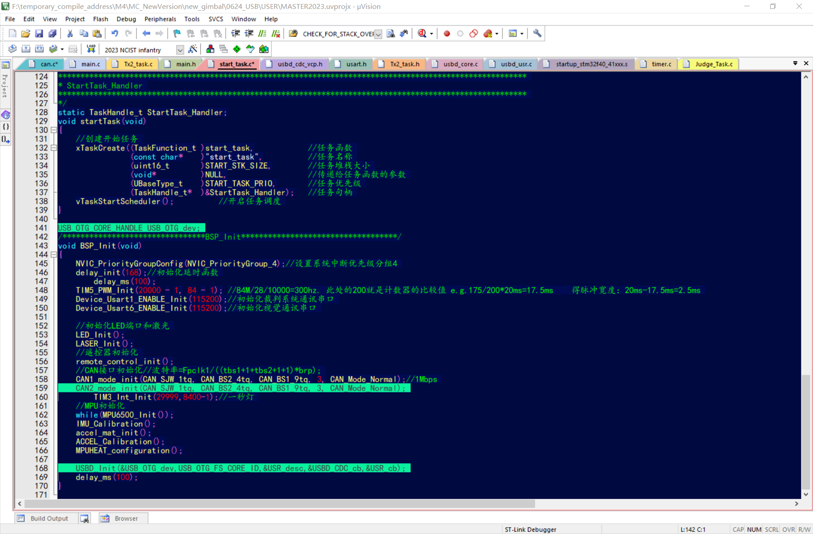

# USB虚拟串口移植————基于STM32 & FreeRTOS
## 文件移植&工程构成 

> https://github.com/StarTao114/USB_ACM
>
> 这是这份程序的仓库，可以在上面下载源代码，也可以在github上与我进行讨论
>
> 如果觉得有用，请为我点亮Star！！！！

1. 将USB文件夹整个放入工程中（与USER文件夹同级） 
    

    

2. 在工程中添加三个新的文件夹，并分别填入对应文件 
    
 

    

3. 找到Options for Target... -> C/C++ -> Define 

  > 添加**USE_USB_OTG_FS** 
  >
  > 为了使能USB_OTG高速功能 

4. 添加头文件路径 

## 具体代码实现

1. 导包（包含头文件）

在初始化的 **.c** 文件中，包含如下的头文件：

 
在调用USB收发功能的 **.c** 文件中，使用 **#include "usbd_usr.h"**

2. 初始化

添加USB初始化函数，如下图：

 

> 注意事项：
>
> 1. 声明变量**USB_OTG_dev**后再初始化 
> 2. 因为旧版开发版的CAN1占用了PA11和PA12（使用USB虚拟串口必要的两个IO），因此需要将CAN1重新分配到其他引脚，如PB8和PB9 
> 3. 为了确保声明成功，请尽量将USB的初始化函数放到串口（USART）和CAN的声明后面 

3. USB连接状态查看 

我们需要将LED4作为USB连接状态的指示灯，方便调试时查看 

> 该函数的下半是数据发送部分，包含了crc8校验，若不需要，可自行删除
>
> 对于 **喂狗** 行为，放在了确定收到正确报文后，以保证运行正常

**bDeviceState** 被调用在 **usbd_usr.c** 中 

> printf调用了串口1的putc函数，因此最好先初始化USART1 
>
> 祖传程序中，LED4用作错误次数指示，用处不大，在 **detect.task.c** 将其禁用，避免影响对连接状态的查看 
>
> 这些都是回调函数，debug时打断点也是不会停的，所以LED指示工作状态是有必要的 

4. 改写接收回调函数 

> 整体上和串口接收没什么区别，这里只有帧头帧尾校验，没用到crc8，如有需要请自行添加 
>
> 其中调用了宏 **MINIPC_FRAME_LENGTH** ，需要在对应的头文件中声明： 
>
> e.g. #define MINIPC_FRAME_LENGTH		14u				//与视觉约定的包长度 

5. 改写接收函数 

> 使用USB库封装的VCP_DataTx()函数，通过USB虚拟虚拟串口向上位机发送数据 

## 实际效果

1. 视觉那边不需要再选择波特率，但是识别出的端口从ttyUSBx变成了ttyACMx，需要在open文件时修改名称

   > 附视觉代码（我改的粗糙代码，至少通信上了，如有不满，轻喷）：
   >
   > [粗糙的测试程序](./USBDevevoperGuide/Program/VisionTest.zip)
   >
   > 尚未实现热插拔，需要加其他库
   >
   > 可能存在 **sudo** 能打开文件，但是程序里的 **open** 函数不行的问题：
   >
   > > 初步认为是没有USB通信文件的权限，需要取得rwx全部权限

2. 不再需要外围芯片，也可能不需要接线，从STM32的IO连一根USB线，直连miniPC，减少干扰因素

   > 需要修改硬件电路：
   >
   > 将CAN1接到PB8和PB9，将PC11和PC12接到USB口
   >
   > Warning：USB的差分信号需要阻抗匹配！

3. 从串行信号变为差分信号，信号抗干扰能力提升

4. 通信频率极大提高

5. 现在的云台没有放USB接线的空间，后面需要留出

   > 之前忘了拍通信效果图，想起来的时候，板子已经上车了

6. 附电控步兵的使用实例

   > [涉及到修改的文件](./USBDevevoperGuide/Program/Public.zip)
